# SaaS管理ツール POC — 画面説明書

> 上長提出用資料 | 作成日: 2026年2月

---

## 1. はじめに

### 背景

現在、SaaS（約260件）のアカウント管理に **DXECO**（年間204万円）を利用しています。
本POCは、DXECOの代替として自社開発の実現性を検証するものです。

### 目的

- DXECOと同等以上の機能を自社開発で実現できることを実証
- 年間約198万円（5年で約990万円）のコスト削減ポテンシャルを示す
- DXECOにはない機能（承認ワークフロー、Entra ID連携等）の付加価値を提示

### 技術スタック

Ruby on Rails 8 / PostgreSQL / Bootstrap 5 / Microsoft Entra ID SSO / Azure Container Apps

---

## 2. ログイン

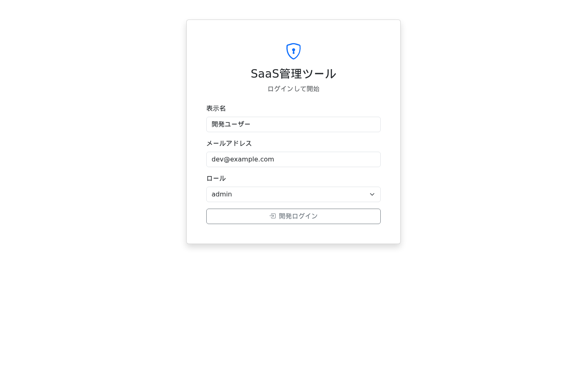

- **Entra ID SSO（シングルサインオン）** による認証
  - 社内のMicrosoft 365アカウントでそのままログイン可能
  - DXECOはID/パスワード認証のため、セキュリティ面で優位
- ロールベースアクセス制御（管理者 / マネージャー / 閲覧者の3段階）

---

## 3. ダッシュボード

### 概要・KPI

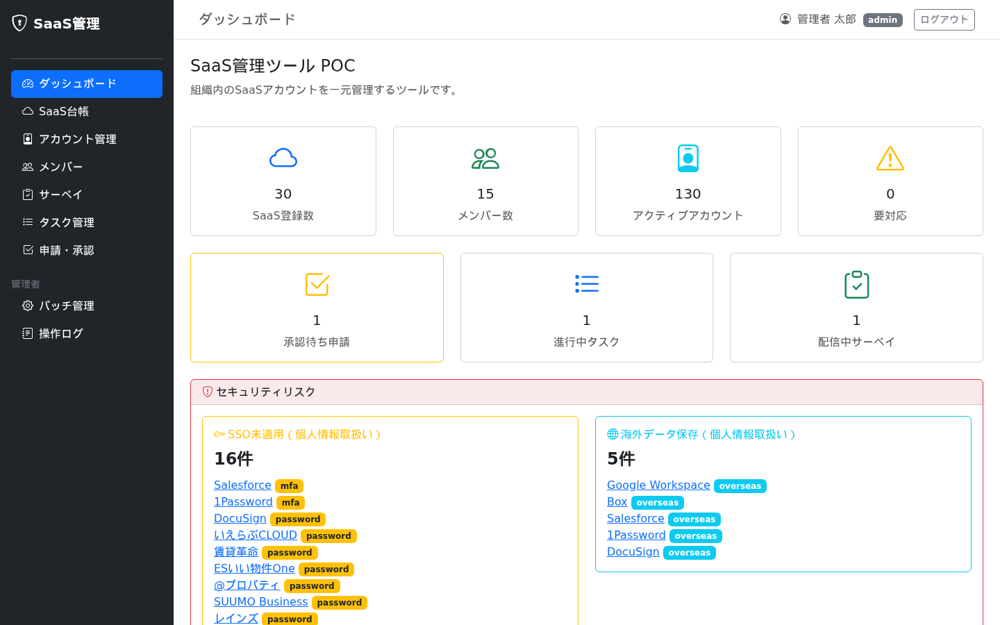

- **SaaS数・アカウント数・メンバー数**をカード形式で即時把握
- 承認待ち件数、タスク進捗、契約期限アラートを一画面に集約
- 経営層・管理者が「今何をすべきか」をすぐに判断できる設計

### セキュリティリスク

- **個人情報を扱うSaaSのうちSSO未対応のもの**を自動検出・警告
- **海外にデータ保存されるSaaS**のリスク可視化
- DXECOにはないセキュリティ可視化機能

### コスト概要

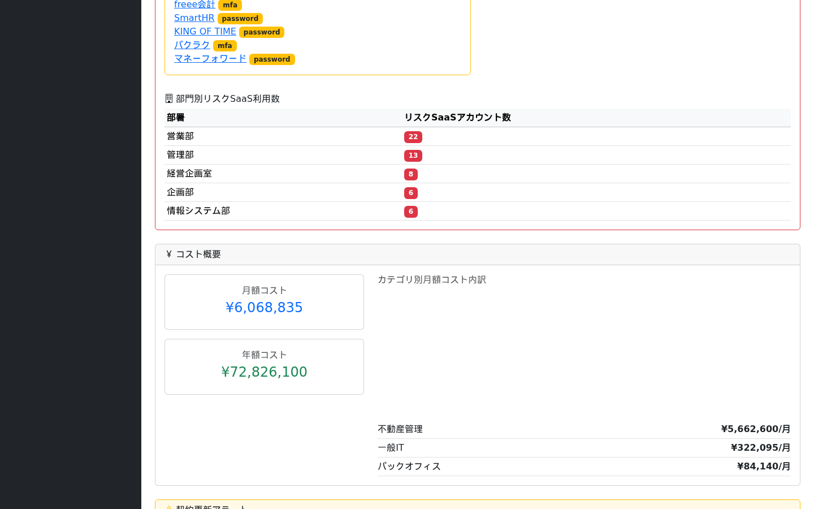

- SaaS全体の **月額・年額コスト** を自動集計
- カテゴリ別のコスト内訳をグラフで可視化
- 契約更新時の予算計画に活用可能

---

## 4. SaaS台帳

### 一覧

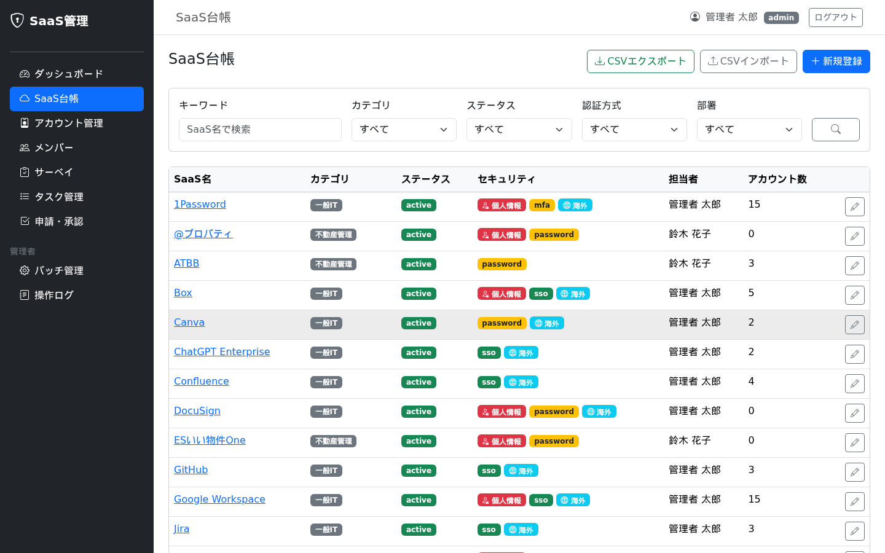

- 全SaaS（約260件）を一元管理
- **カテゴリ・ステータス・認証方式・データ保存先**でフィルタリング
- 検索バーによる横断検索

### 詳細

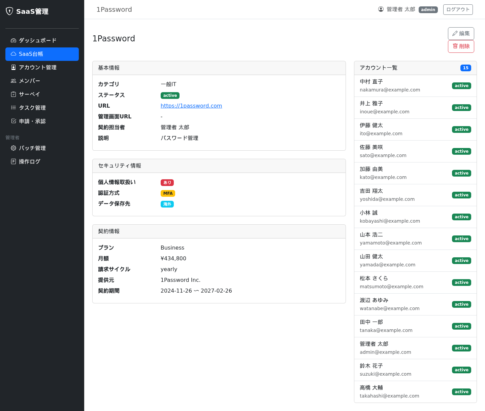

- SaaSごとの詳細情報（契約情報、セキュリティ属性、利用アカウント一覧）
- **個人情報取扱い・認証方式・データ保存先**などセキュリティ属性を管理
- 契約期間・月額費用・更新日をトラッキング

---

## 5. アカウント管理

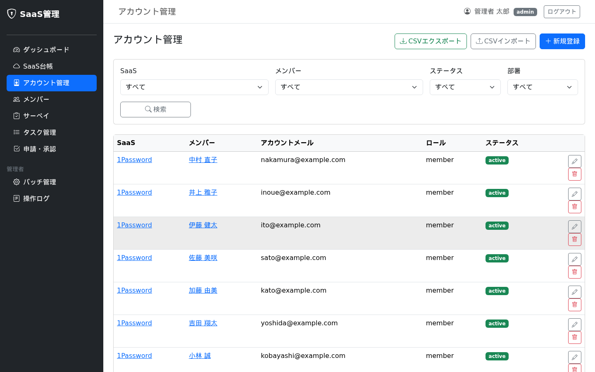

- **「誰がどのSaaSを使っているか」** を横断的に把握
- 部署・SaaS名・ステータスでフィルタリング
- 不要アカウントの特定によるコスト最適化に活用

---

## 6. メンバー管理

### 一覧

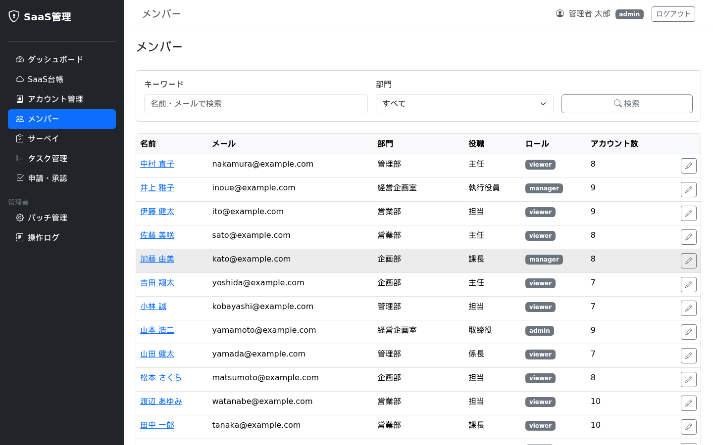

- Entra ID（Azure AD）から **自動同期** されたメンバー情報
- 部署・役職・ステータスを一覧表示
- 手動でのメンバー登録作業が不要

### 詳細

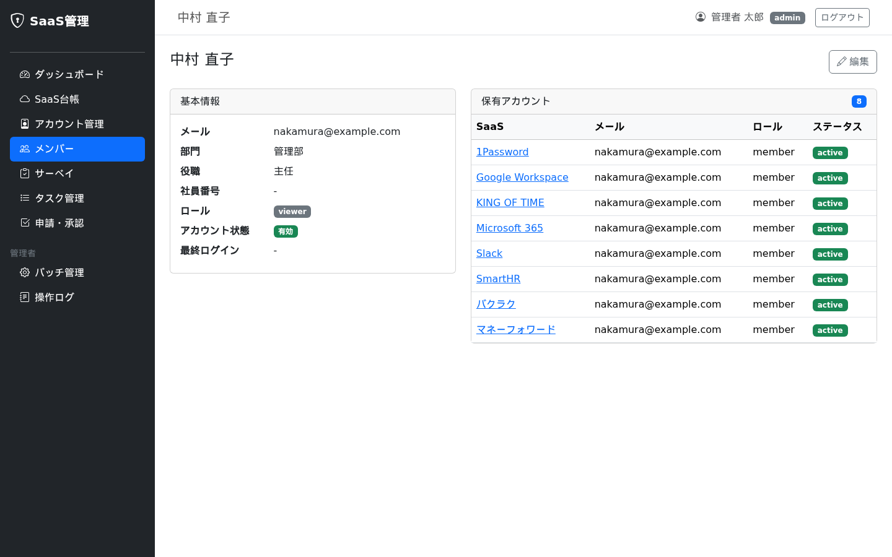

- メンバーごとの **保有SaaS一覧** を表示
- 入退社・異動時の引き継ぎ漏れ防止に活用
- DXECOでは手作業だったメンバー情報管理を自動化

---

## 7. サーベイ（アカウント棚卸し）

### 一覧

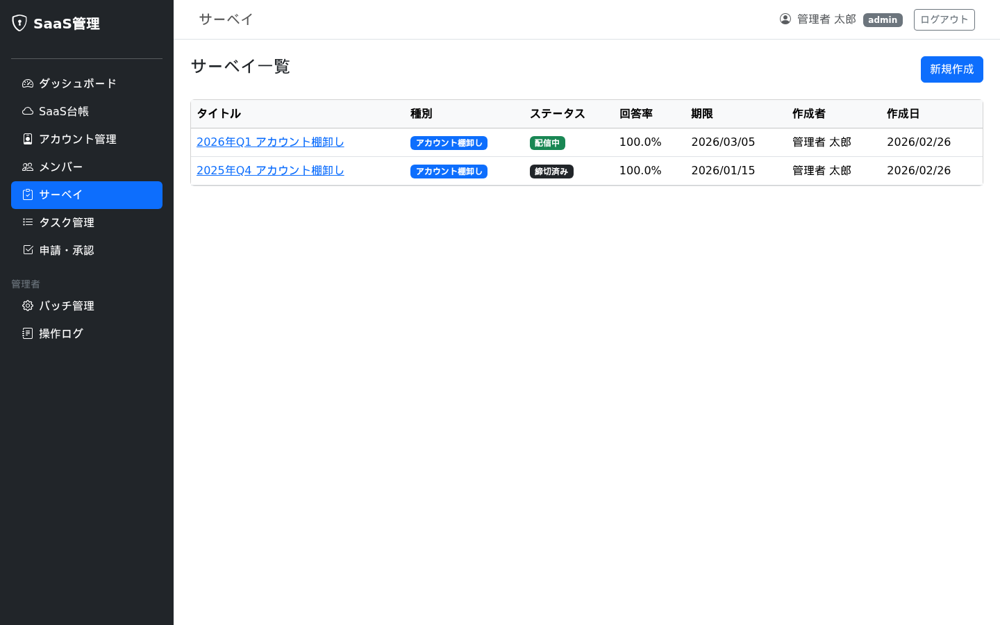

- 定期的なSaaSアカウントの **利用実態調査**
- 「利用中」「未使用」「パスワード変更済み」等の回答を収集
- 回答状況をリアルタイムで集計

### 詳細

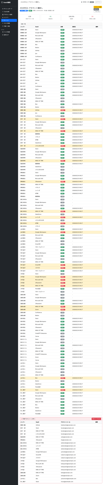

- サーベイごとの回答一覧・集計結果
- 未回答者の把握とTeams通知によるリマインド
- 回答結果から自動でタスク生成（パスワード未変更→変更依頼タスク）

---

## 8. タスク管理

### 一覧

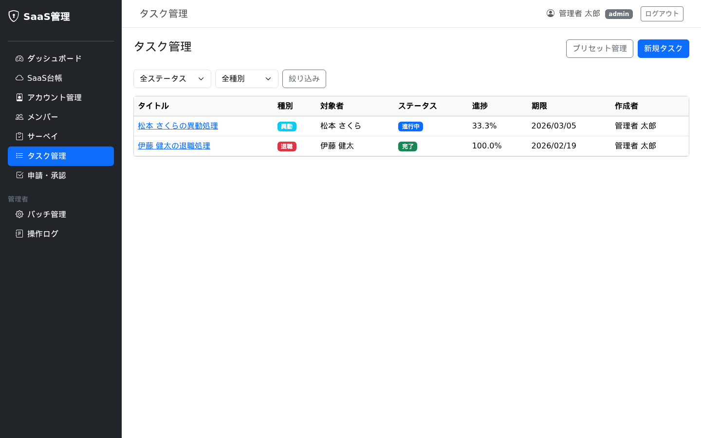

- 入退社・異動に伴う **SaaSアカウントの追加・削除・権限変更** をチェックリスト化
- プリセットテンプレートから一括生成可能
- ステータス管理で進捗を可視化

### 詳細

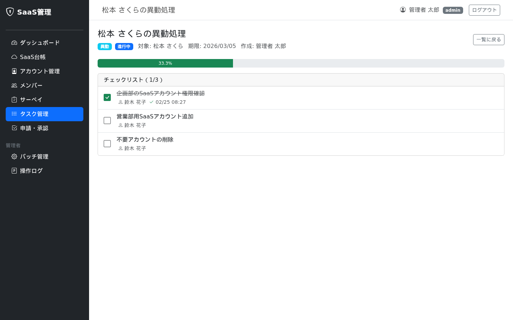

- タスクアイテム（個別作業）の完了チェック
- 担当者へのメール通知・Teams通知
- 対応漏れの防止と作業証跡の記録

---

## 9. 申請・承認ワークフロー

### 一覧

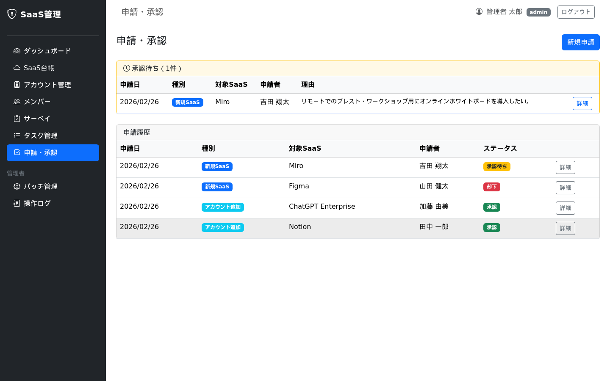

- SaaSの **追加・削除申請** をワークフローで管理
- 申請→承認→実行のプロセスを電子化
- **DXECOにはない機能** — 現状はメール・口頭で処理している業務を効率化

### 詳細

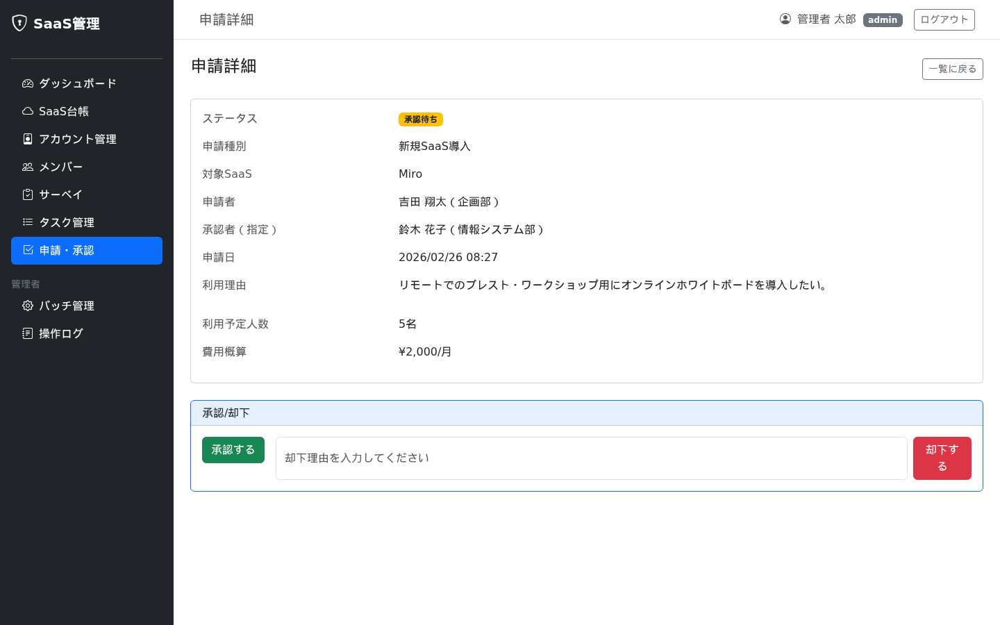

- 申請内容の詳細確認と承認・却下操作
- 承認履歴の記録（監査対応）
- 承認時にメール・Teams通知で関係者に自動連絡

---

## 10. バッチ管理（管理者機能）

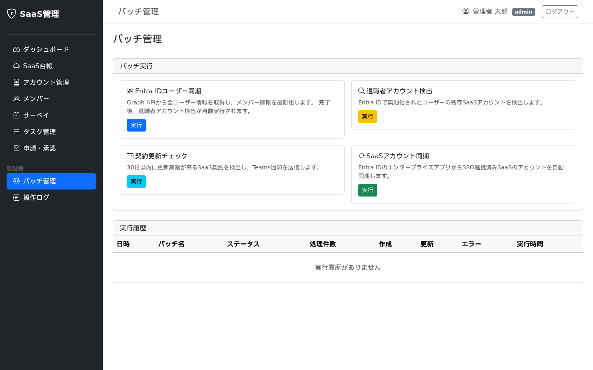

- **Entra IDユーザー同期**：Azure ADから自動でメンバー情報を取得・更新
- **退職者アカウント検出**：Entra IDで無効化されたユーザーのSaaSアカウントを自動検出
- 実行履歴・成功/失敗件数を記録し、運用の透明性を確保
- DXECOでは手作業CSVインポートで対応していた業務を完全自動化

---

## 11. 操作ログ（監査対応）

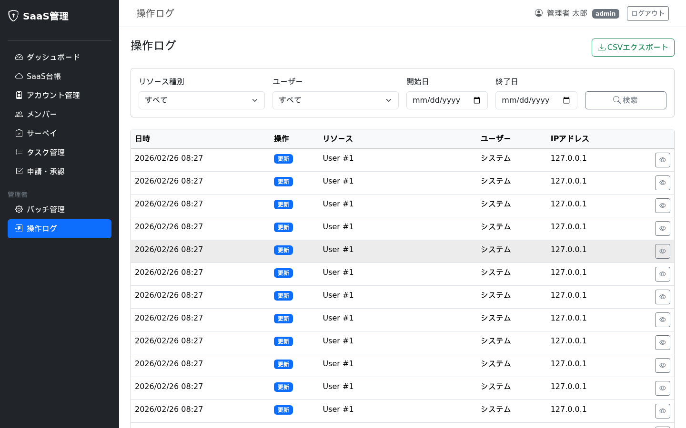

- すべての操作（作成・更新・削除）を **自動記録**
- 「誰が・いつ・何を・どう変更したか」を変更差分付きで保存
- IPアドレスも記録し、不正アクセスの追跡が可能
- **DXECOでは有料オプション（年12万円）** — 本ツールでは標準搭載

---

## 12. データ入出力（CSVエクスポート）

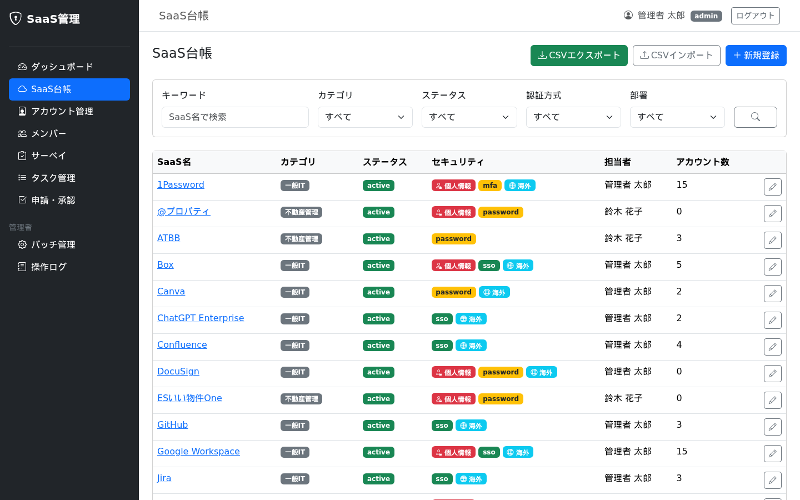

- SaaS台帳・アカウント一覧を **CSVエクスポート**
- フィルタ条件を反映したエクスポートが可能
- 既存データの **CSVインポート** にも対応（移行コスト最小化）
- Excel等での二次加工・レポート作成に活用

---

## 13. メール通知

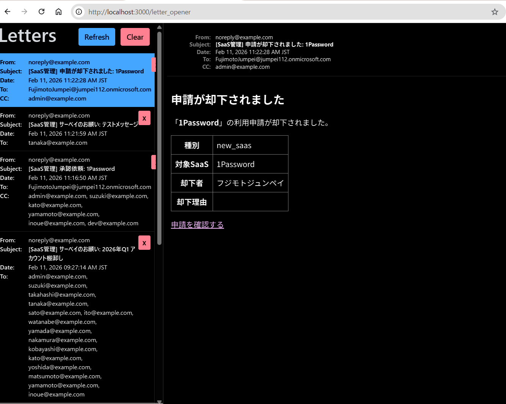

- タスク割り当て・承認依頼・サーベイ回答依頼を **自動メール通知**
- Teams Webhook通知との併用で確実な情報伝達
- 対応漏れの大幅削減

> ※ 上記はテスト環境でのメールプレビュー画面です。本番環境ではSMTPで実際にメール送信されます。

---

## 14. まとめ

### コスト比較

| 項目 | DXECO | 自社開発POC |
|------|-------|------------|
| **年間費用** | 204万円 | 約6万円（Azure基盤のみ） |
| 3年間累計 | 612万円 | 約18万円 |
| **5年間累計** | **1,020万円** | **約30万円** |
| **5年間削減額** | — | **約990万円** |

### DXECOとの機能比較

| 機能 | DXECO | 自社開発POC |
|------|-------|------------|
| SaaS台帳管理 | ○ | ○ |
| アカウント管理 | ○ | ○ |
| サーベイ（棚卸し） | ○ | ○ |
| タスク管理 | △（簡易） | ○（プリセット対応） |
| **承認ワークフロー** | **×** | **○** |
| **操作ログ** | 有料（+12万/年） | **標準搭載** |
| **IP制限** | 有料（+12万/年） | **標準搭載** |
| **Entra ID SSO** | **×**（ID/PW認証） | **○** |
| 退職者検出 | 手動CSV | **自動（Entra連携）** |
| Teams通知 | × | ○ |
| カスタマイズ | 有料開発依頼 | **自由・無制限** |

### 品質指標

| 指標 | 値 |
|------|-----|
| RSpecテスト | 291件 |
| E2Eテスト（Playwright） | 73件 |
| テストカバレッジ | 95.6% |
| CI/CD | GitHub Actions（5ジョブ） |
| セキュリティスキャン | Brakeman + bundler-audit |

### 自社開発の優位点

1. **大幅なコスト削減** — 年間約198万円、5年で約990万円
2. **セキュリティ強化** — Entra ID SSO、操作ログ標準搭載
3. **業務効率化** — 承認ワークフロー、退職者自動検出
4. **柔軟なカスタマイズ** — 社内要件に合わせた機能追加が自由
5. **高い品質基準** — テストカバレッジ95.6%、CI/CDによる自動品質管理
